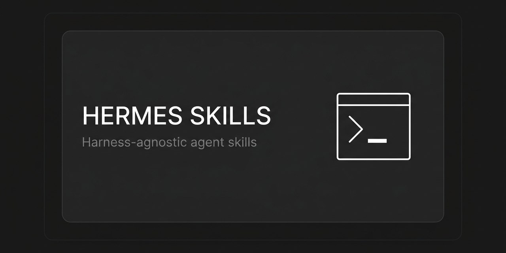

# 🧰 Hermes Skills

[](LICENSE)
[](https://agentskills.io)

A collection of reusable, harness-agnostic skills for AI coding agents — built from real workflows, packaged in the standard [agentskills.io](https://agentskills.io) SKILL.md format.

<p align="center">
  
</p>

## Compatible with

Works with **Hermes Agent, Claude Code, Cursor, VS Code Copilot, OpenHands, OpenClaw, Codex CLI, Aider, Continue** — any agent that reads SKILL.md.

## Install

Copy the skill folder into your agent's skills directory (e.g. `~/.hermes/skills/`, `~/.claude/skills/`), or install straight from this repo with the [`skills`](https://agentskills.io) installer:

```bash
npx skills add itsfedor/hermes-skills -g -y
```

## Requirements

Per skill — each SKILL.md lists what it needs. For `esl-video-review-summary`:

- an agent that reads SKILL.md
- [ffmpeg](https://ffmpeg.org/) on PATH
- a [Deepgram](https://deepgram.com/) API key (free tier works) as `DEEPGRAM_API_KEY`
- a homework review recording to process

## Skills

### education

| Skill | What it does |
|---|---|
| [esl-video-review-summary](education/esl-video-review-summary/SKILL.md) | Turns a recorded homework review video (teacher speaking English + Russian) into a student-facing HTML summary: extract audio → transcribe via Deepgram (nova-3, detect_language, raw-body request) → one section per homework task with color-coded fixes, strengths, practice tips (test-english links), and next homework. |

## Contributing

Skills here are extracted from real completed workflows and verified against actual runs. If you adapt one for your own stack, keep the SKILL.md frontmatter (name, description, version) intact so indexes pick it up.
